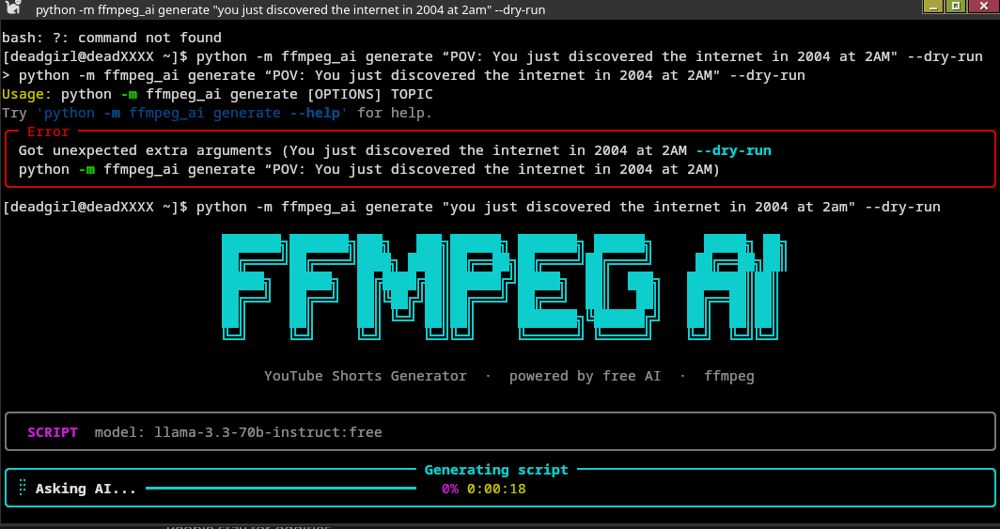
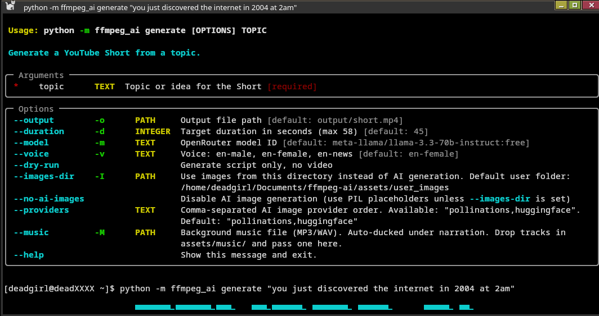

# ffmpeg-ai

a python cli that generates youtube shorts (and landscape videos) end-to-end using only free ai services. give it a topic, get back a video with voiceover, burned captions, ken burns motion, and ai-generated visuals.

---

## screenshot — pipeline running



---

## screenshot — example output



---

## what it does

1. generates a script from your topic via openrouter (free llm, auto-fallback through 7 models)
2. synthesizes voiceover with edge-tts — hook, each segment, and cta in parallel
3. fetches ai images synced to script segments (7 providers, cascading fallback)
4. applies ken burns motion + random xfade transitions to build video clips
5. transcribes audio locally with faster-whisper to produce burned-in captions
6. optionally mixes background music with sidechain compression
7. final encode to spec (shorts 9:16 or landscape 16:9)

output includes a thumbnail jpeg alongside the mp4.

---

## install

requires python 3.11+, ffmpeg on your `$PATH`, and [uv](https://github.com/astral-sh/uv).

```bash
git clone https://github.com/numbpill3d/ffmpeg-ai.git
cd ffmpeg-ai
uv pip install -e ".[dev]"
```

copy `.env.example` to `.env` and add your openrouter key:

```bash
cp .env.example .env
# edit .env — get a free key at https://openrouter.ai
```

---

## usage

```bash
# basic short
ffmpeg-ai generate "the history of the moon"

# landscape video (up to 10 min)
ffmpeg-ai generate "history of the roman empire" --mode landscape -d 300

# style preset
ffmpeg-ai generate "deep sea creatures" --style dramatic

# caption style
ffmpeg-ai generate "stoic philosophy" --caption-style plain

# edit the script before rendering
ffmpeg-ai generate "mars colonization" --edit-script

# add background music (auto-ducked under narration)
ffmpeg-ai generate "ancient egypt" --music ~/music/ambient.mp3

# use your own images instead of ai generation
ffmpeg-ai generate "topic" --images-dir ~/my-images/

# batch generate from a topics file (one topic per line, # = comment)
ffmpeg-ai batch topics.txt -o ~/Videos/batch/

# resume a job (uses cached script + images)
ffmpeg-ai generate "the history of the moon"

# force fresh run, ignore all cache
ffmpeg-ai generate "the history of the moon" --fresh

# dry run — script only, no video rendered
ffmpeg-ai generate "any topic" --dry-run
```

---

## output modes

| mode      | resolution    | aspect | max length |
|-----------|---------------|--------|------------|
| shorts    | 1080 × 1920   | 9:16   | 58 seconds |
| landscape | 1920 × 1080   | 16:9   | 10 minutes |

both modes use h.264 + aac, burned-in captions, ken burns motion, and xfade transitions.

---

## style presets (`--style`)

| preset       | tone                                              |
|--------------|---------------------------------------------------|
| educational  | authoritative, measured, surprising fact → implication |
| dramatic     | cinematic, intense, short punchy sentences        |
| listicle     | countdown format, numbered points, fast cuts      |
| documentary  | journalistic, reflective, context → story → insight |

---

## caption styles (`--caption-style`)

| style       | description                                      |
|-------------|--------------------------------------------------|
| karaoke     | word-level highlight, 3 words per line (default) |
| plain       | clean subtitles, 6 words per line                |
| bold-center | large centered text, 3 words per line            |

---

## image providers

tried in this order, falling back on failure. all paid keys are optional.

| provider       | env var              | notes                              |
|----------------|----------------------|------------------------------------|
| bfl            | `BFL_API_KEY`        | flux 1.1 pro (paid)                |
| fal            | `FAL_KEY`            | flux dev via fal.ai (paid)         |
| prodia         | `PRODIA_TOKEN`       | flux schnell, ultra-fast (paid)    |
| pollinations   | —                    | flux-realism / flux, free, no key  |
| huggingface    | `HF_TOKEN`           | flux schnell + sdxl fallback       |
| stable_horde   | `STABLE_HORDE_API_KEY` | community cluster, guest key built-in |
| together       | `TOGETHER_API_KEY`   | flux schnell free tier             |

override the order with `--providers bfl,fal,pollinations`.

---

## job cache

each job is cached at `~/.cache/ffmpeg-ai/jobs/<slug>/`:

- `script.json` — reused on re-run unless `--fresh`
- `images/frame_*.jpg` — reused if count matches
- `tts/` — always re-synthesized

re-running the same topic resumes from cached data automatically.

---

## project structure

```
src/ffmpeg_ai/
├── cli.py           # typer entrypoint + all commands
├── pipeline.py      # orchestrates the full generation pipeline
├── ai/
│   ├── openrouter.py    # llm client, model fallback logic
│   ├── images.py        # multi-provider image generation
│   └── tts.py           # edge-tts voiceover
├── video/
│   ├── composer.py      # all ffmpeg subprocess calls
│   ├── captions.py      # faster-whisper + ass/srt generation
│   └── shorts.py        # video spec constants (resolution, fps, codec args)
└── ui/
    ├── display.py        # animated ascii banner
    └── widgets.py        # rich live pipeline tracker
```

---

## env vars

| var                   | required | purpose                          |
|-----------------------|----------|----------------------------------|
| `OPENROUTER_API_KEY`  | yes      | llm script generation (free tier)|
| `BFL_API_KEY`         | no       | black forest labs flux 1.1       |
| `FAL_KEY`             | no       | fal.ai flux dev                  |
| `PRODIA_TOKEN`        | no       | prodia flux schnell              |
| `HF_TOKEN`            | no       | huggingface inference            |
| `STABLE_HORDE_API_KEY`| no       | registered horde key (priority)  |
| `TOGETHER_API_KEY`    | no       | together ai flux schnell free    |
| `EDITOR`              | no       | editor for `--edit-script`       |

---

## dev

```bash
uv pip install -e ".[dev]"
ruff check src/
```

---

## license

mit
